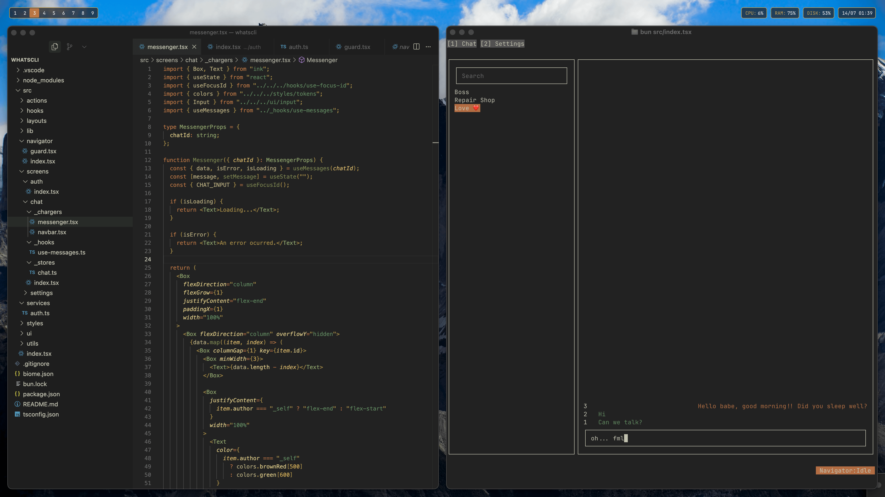

# whatscli



This project is an experiment about how to create TUIs. 

I started studying how to create TUIs and found about Ink, a framework to craft custom terminal interfaces with TypeScript and React (and for this specific case, Bun).

The future of this project is to integrate WhatsApp API and have WhatsApp in the terminal. It will not be fully featured as WhatsApp, but I think we can do pretty good things with it.

**Do not use this project in production. There are (possibly) a lot of bugs.**

## Things I challenged myself to implement

Since this is an experimental project, I set myself some challenges. Why? Because it's fun 😄.

Some items from the list:

- Can't use React Context;
- Create a **minimal** version of React Router;
- Create a **minimal** version of React Query;
- Work around the Notifier (Signals-like) pattern;

I have done pretty much all of this (with a really simple, basic and non-tested code).

## What I haven't done

Basically, everything else 😀.

This is just the first version, and there's A LOT of things to do, like:

- Keybinds with modifier keys (ctrl)
- Mutations as from React Query Mutations;
- Proper type inference on routes;
- Integrate WhatsApp with [WWEBJS](https://docs.wwebjs.dev/index.html);
- Tests and more tests;

## Specs

This project uses **Bun** because of its simplicity in working with TypeScript.

```sh
bun install
bun src/index.tsx
```

I'll do more updates soon.

Feel free to enjoy the ride!
